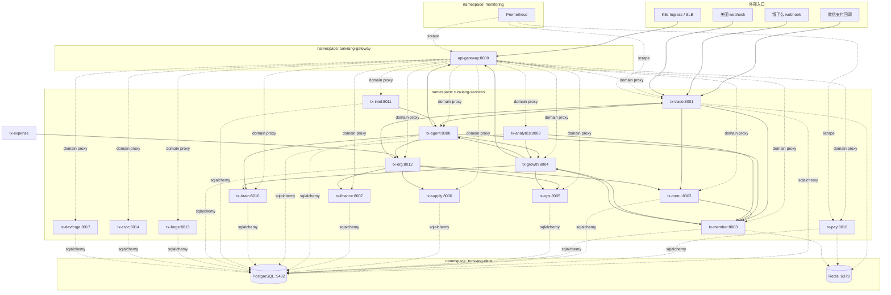

# 屯象OS 服务依赖图（NetworkPolicy 启用前必读）

**对应审计项**：S-02 part 4 纵深防御 — k8s NetworkPolicy 限制只 gateway 可达 tx-* services
**生成时间**：2026-05-06
**生成方法**：grep `services/*/src/` 中的 `http://tx-*` / `http://gateway` URL，自动构建

启用 NetworkPolicy 前**必须**对照本图核对：错误的 ingress/egress 规则会断
服务间通信，导致业务全停。本图基于代码 grep + 审计 02-architecture 已识别
依赖，但**不一定包含**：
- runtime 动态发现（如 service mesh sidecar）
- 间接依赖（A 调 B，B 调 C，A 不调 C）
- 跨域 webhook（外部 → tx-trade）

启用前 ops 必须用 `kubectl logs` 抽样确认没有遗漏。

---

## 服务依赖图（mermaid）



---

## 每服务的 ingress / egress 矩阵

按 `grep services/*/src/` 自动构建。**自动构建可能漏，启用前 ops 必须人工核对。**

| 服务 | 入站源 | 出站目标 |
|---|---|---|
| **api-gateway** | K8s Ingress / 公网 / Prometheus | 所有 tx-* / PG / Redis / DNS |
| **tx-trade** | gateway / 微信回调 / 美团/饿了么 webhook / Prometheus | tx-agent / tx-member / tx-menu / PG / Redis / DNS |
| **tx-pay** | gateway / Prometheus | 微信/支付宝/拉卡拉/收钱吧 公网 API / PG / DNS |
| **tx-menu** | gateway / Prometheus | tx-member / PG / DNS |
| **tx-member** | gateway / Prometheus | tx-growth / PG / Redis / DNS |
| **tx-growth** | gateway / Prometheus | tx-agent / tx-brain / tx-member / tx-ops / gateway / PG / DNS |
| **tx-ops** | gateway / Prometheus | PG / DNS |
| **tx-supply** | gateway / Prometheus | PG / DNS |
| **tx-finance** | gateway / Prometheus | PG / DNS |
| **tx-agent** | gateway / Prometheus | tx-brain / tx-growth / tx-member / tx-org / gateway / Claude API 公网 / PG / DNS |
| **tx-analytics** | gateway / Prometheus | tx-growth / tx-member / PG / DNS |
| **tx-brain** | gateway / Prometheus | Claude API 公网 / PG / DNS |
| **tx-intel** | gateway / Prometheus | tx-agent / PG / DNS |
| **tx-org** | gateway / Prometheus | tx-finance / tx-menu / tx-ops / tx-supply / tx-trade / PG / DNS |
| **tx-forge** | gateway / 公网 / Prometheus | PG / DNS |
| **tx-civic** | gateway / 政府监管平台公网 API / Prometheus | PG / DNS |
| **tx-devforge** | gateway / Prometheus | PG / DNS |
| **tx-expense** | gateway / Prometheus | tx-org / PG / DNS |
| **tx-predict** | gateway / Prometheus | PG / DNS |
| **tx-indonesia/malaysia/vietnam** | gateway / 当地公网 API / Prometheus | PG / DNS / 当地支付公网 |
| **tunxiang-api** | gateway / Prometheus | PG / DNS |
| **mcp-server** | Claude Code 客户端 (TCP/stdio) | 所有 tx-* / PG / DNS |

---

## 已知遗漏 / 灰色地带

启用 NetworkPolicy 前 ops 必须人工确认：

1. **Webhook 回调来源 IP 白名单**：微信/支付宝/拉卡拉的回调 IP 范围需写入 ingress 白名单（公网 → tx-trade /api/v1/banquet/deposit/callback）。当前 NetworkPolicy 模板没列 IP CIDR，启用 strict 模式会断回调。
2. **edge sync-engine 入站**：Mac mini 通过 Tailscale 调云端 `/api/v1/sync/*`（在 tx-trade 路由）。Tailscale CIDR 是动态的，需 ops 配 ingress IP block 或者保留公网 ingress。
3. **CronJob / kubernetes Job**：未跑过梳理，可能有定时任务在 default namespace 调 tx-* services。
4. **service mesh sidecar**（如未来上 Istio）：会有 envoy → service 的入站，需另加规则。

---

## 启用 NetworkPolicy 的 cutover 路径

### 阶段 A — staging permissive（D1）

应用 `infra/helm/_overrides/networkpolicy-s02-cutover.yaml`：
- ingress: 严格只 gateway namespace + monitoring
- egress: PG / Redis / DNS / 所有 tx-* 同 namespace + 公网（保守，防止断回调/AI 调用）

观察 24h，确认无业务回归。

### 阶段 B — staging strict（D3）

切换到 `infra/helm/_overrides/networkpolicy-s02-cutover-strict.yaml`（待写）：
- egress: 仅按上表精确收紧到具体目标
- 公网 egress 走专门的 egress gateway pod

### 阶段 C — 灰度门店

按 cutover playbook 阶段 F-G（参 `docs/runbooks/audit-2026-05-cutover.md`）。

### 阶段 D — 全量

24h 监控通过后切全量。回滚条件：任何业务路径返 5xx 或 timeout。

---

## 应用命令（参考）

```bash
# 单 chart 应用（dry-run 先看）
helm upgrade --install --dry-run \
  tx-trade infra/helm/tx-trade \
  -f infra/helm/_overrides/networkpolicy-s02-cutover.yaml

# 全量应用
bash scripts/k8s/apply_networkpolicy_s02.sh staging

# 快速回滚
helm upgrade tx-trade infra/helm/tx-trade --reset-values
# 或：kubectl delete networkpolicy --all -n tunxiang-services
```
